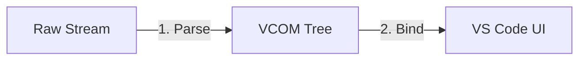

# Explainer: Why Chat Needs a "DOM" (The VCOM Pipeline)

**Status:** Draft
**Related Spec:** [VS Code Chat Object Model (VCOM)](./spec.md)

## The "Aha!" Moment

When building a chat interface for an LLM, it is tempting to treat the output as a simple stream of text. You receive a chunk, you append it to the screen. Simple.

But what happens when that "text" contains a complex, interactive tool invocation?

```xml
I will run the tests.
<exo-tool name="npm-test" status="running" />
```

If we treat this as a stream, we run into two major problems that ruin the user experience: **The Flicker** and **The Ghost**.

This document explains why we moved away from a "direct stream" approach to a **Pipeline Architecture** that introduces a "DOM" for chat.

## The Problem

### 1. The Flicker (Streaming is Chaos)
LLMs do not respect grammar when they stream. A tag like `<exo-tool>` might be split across two network packets:

*   **Packet 1:** `I will run <exo-`
*   **Packet 2:** `tool name="npm" />`

If we render directly to the UI, the user sees:
1.  "I will run `<exo-`" (Raw text garbage)
2.  *Screen flashes*
3.  "I will run [Tool Widget]" (Garbage replaced by widget)

This "flicker" makes the interface feel janky and unpolished.

### 2. The Ghost (Widgets need Identity)
Let's say we successfully render a "Running" tool widget. Ten seconds later, the tool finishes. We need to update that widget to say "Complete".

If we just pushed HTML/Markdown to VS Code, we have no "handle" to that specific widget. It's a ghost in the UI. We can't update it; we can only append *new* text. This forces us to print a new "Done" message, cluttering the chat history.

## The Solution: A "DOM" for Chat

To solve this, we stopped treating Chat as a **Stream** and started treating it as a **Document**.

Just as a web browser parses HTML into a DOM tree before rendering pixels, we parse the LLM stream into a **VCOM Tree** before calling VS Code APIs.

### The Architecture

We call this the **Direct Pipeline**. It has three distinct stages:



### Stage 1: The Parser (The "Shock Absorber")
The Parser's job is to absorb the chaos of the network. It buffers incomplete tags and waits until it has a complete, valid semantic unit before telling anyone.

*   **Input:** `I will run <exo-`
*   **Action:** "Wait. This looks like a tag, but it's incomplete. I'll hold onto this."
*   **Output:** (Silence)

When the rest of the tag arrives, *then* it emits a clean Node. The UI never sees the garbage.

### Stage 2: The VCOM Tree (The Source of Truth)
This is the most important part. Instead of ephemeral API calls, we have a persistent data structure representing the conversation.

```typescript
// The VCOM Tree
[
  { kind: "text", value: "I will run the tests." },
  { 
    kind: "tool", 
    id: "tool-1", 
    name: "npm-test", 
    state: "running" // <--- We can change this later!
  }
]
```

This tree is our "DOM". It allows us to:
1.  **Update State:** When the tool finishes, we just change `.state = "complete"` in the tree.
2.  **Test Logic:** We can write unit tests against this JSON tree without spinning up VS Code.

### Stage 3: The Binder (The Artist)
The Binder observes the Tree and "paints" it to VS Code.

*   It sees a `VCOMText` node? It calls `markdown()`.
*   It sees a `VCOMTool` node? It draws a custom Tool Widget.
*   It sees that `VCOMTool` node change? It updates the *existing* widget in place.

## Example: The "Split Packet" Scenario

Let's watch the pipeline handle the "Flicker" scenario from earlier.

| Event | Parser State | VCOM Tree | User Sees |
| :--- | :--- | :--- | :--- |
| **Packet 1:** `I will <exo-` | Buffering `<exo-` | `[Text("I will ")]` | "I will " |
| **Packet 2:** `tool />` | **Match!** `<exo-tool />` | `[Text("I will "), Tool]` | "I will [Widget]" |

**Result:** The user never saw the raw `<exo-` text. The interface remained stable.

## Why This Matters

By adopting this architecture, we gain:

1.  **Professional Polish:** No more UI glitches or raw XML leaking into the chat.
2.  **Live Updates:** We can show progress bars and status updates in-place, rather than appending a log of events.
3.  **Portability:** Because the **Parser** and **Tree** are just TypeScript classes, we can run them anywhere—in a CLI, in a web debugger, or in a test runner. The **Binder** is the only part that needs VS Code.
